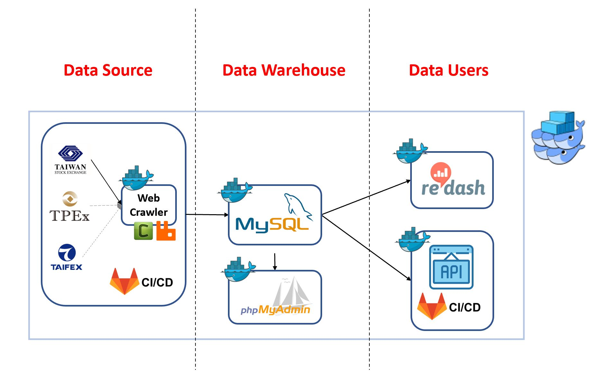

<!-- omit in toc -->
# Table of Contents
- [Introduction](#introduction)
- [Infrastructure](#infrastructure)
- [Future Research](#future-research)

 

# Introduction

To learn how to build the infrastructure of web crawling, I used [FinMind](https://github.com/FinMind/FinMindBook) as a reference. Also, I took note of every part to well summarize what I have learned which was stored in my other git repositories. [FinMind](https://github.com/FinMind/FinMindBook) helps me understand how data products are built and which tools are commonly used in companies. With this direction, I can build the data product on my own and be familiar with many useful tools.

 

# Infrastructure

* Use Docker Swarm to build services to
  * monitor services
  * isolate the environment of services
* Scrape websites from Taiwan Stock Exchange, Taipei Exchange and Taiwan Futures Exchange in the ETL process
* Services are currently built in the same machine
* Use redash and API to see data
* Apply CI/CD into the web crawler and web API

 

# Future Research
* To schedule tasks in Airflow, instead of apscheduler
  * Airflow provides a good UI to see the conditions of tasks.
* Complete the tasks in Celery and rabbitMQ
* Distribute services to different machines